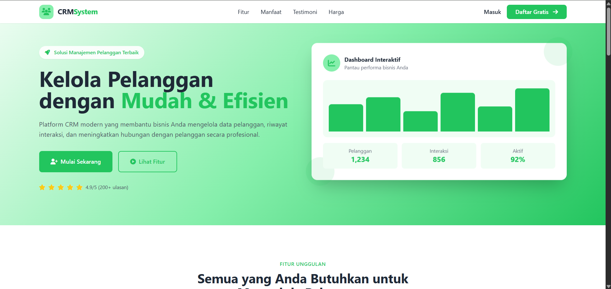
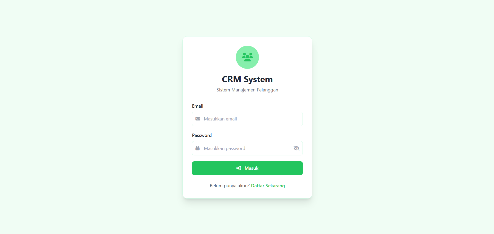
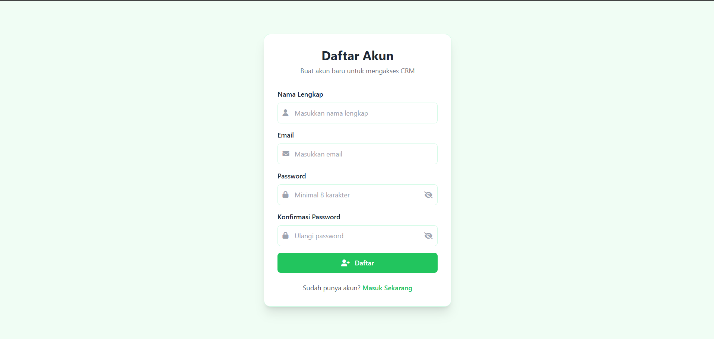
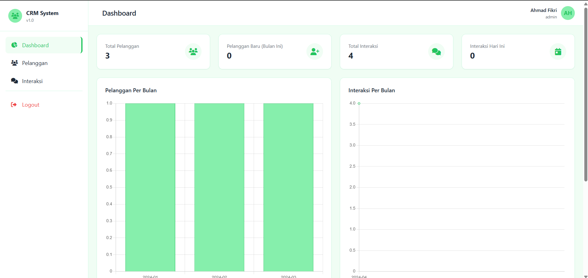
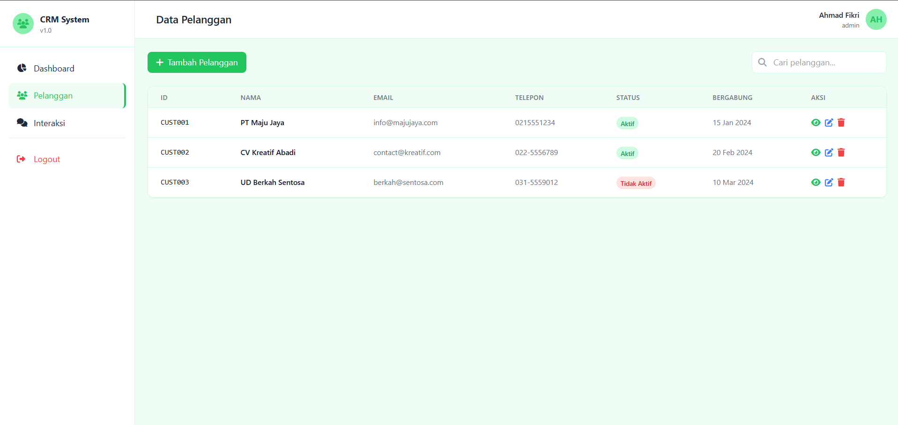
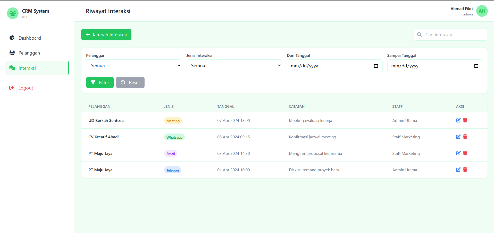

# 🚀 CRM System

A modern Customer Relationship Management (CRM) web application built using **PHP Native**, **MySQL**, **Tailwind CSS**, and **JavaScript**. This application helps businesses manage customer data, record customer interactions, and monitor business activities through an interactive dashboard.

---

## 📌 Features

### 🔐 Authentication
- User Registration
- User Login & Logout
- Password Hashing
- Session Management
- Remember Me
- CSRF Protection

### 👥 Customer Management
- Add Customer
- Edit Customer
- Delete Customer (Admin Only)
- Customer Detail
- AJAX Realtime Search
- Pagination
- Customer Status

### 💬 Interaction Management
- Record customer interactions
- Interaction Types:
  - Phone
  - Email
  - WhatsApp
  - Meeting
- Filter by customer
- Filter by date
- AJAX Search

### 📊 Dashboard
- Total Customers
- New Customers
- Total Interactions
- Today's Interactions
- Customer Statistics Chart
- Interaction Statistics Chart
- Recent Activities

### 🔒 Security
- Password Hashing
- Prepared Statements (PDO)
- SQL Injection Prevention
- XSS Protection
- CSRF Protection
- Role-Based Access Control (RBAC)

---

# 🛠️ Tech Stack

| Technology | Description |
|------------|-------------|
| PHP Native | Backend |
| MySQL | Database |
| Tailwind CSS | CSS Framework |
| JavaScript | Frontend |
| AJAX | Realtime Search |
| Chart.js | Dashboard Charts |
| Font Awesome | Icons |
| Apache / XAMPP | Web Server |

---

# 📂 Project Structure

```text
crm-system/
│
├── assets/
│   ├── css/
│   ├── js/
│   └── images/
│
├── auth/
│   ├── login.php
│   ├── register.php
│   └── logout.php
│
├── dashboard/
│   └── index.php
│
├── customers/
│   ├── index.php
│   ├── create.php
│   ├── edit.php
│   ├── delete.php
│   ├── detail.php
│   └── search.php
│
├── interactions/
│   ├── index.php
│   ├── create.php
│   ├── edit.php
│   ├── delete.php
│   └── search.php
│
├── config/
├── database/
├── index.php
└── README.md
```

---

# 🗄️ Database

Database Name

```text
crm_db
```

Tables

- users
- customers
- interactions

Relationship

```
Users (1) ------< Interactions >------ (1) Customers
```

---

# ⚙️ Installation

## 1 Clone Repository

```bash
git clone https://github.com/username/crm-system.git
```

---

## 2 Import Database

Create a database

```sql
CREATE DATABASE crm_db;
```

Import the SQL file

```
database/crm_db.sql
```

---

## 3 Configure Database

Edit

```
config/database.php
```

Example

```php
$host = "localhost";
$dbname = "crm_db";
$username = "root";
$password = "";
```

---

## 4 Start Server

Move project into

```
htdocs/
```

Run

```
http://localhost/crm-system
```

---

# 🔑 Default Login

## Admin

Email

```
admin@crm.com
```

Password

```
password
```

---

## Staff

Email

```
staff@crm.com
```

Password

```
password
```

---

# 📈 Dashboard

Dashboard provides

- Total Customers
- Total Interactions
- New Customers
- Today's Interactions
- Customer Chart
- Interaction Chart
- Recent Activities

---

# 🔒 Security

Implemented security features

- Password Hashing
- CSRF Token
- Prepared Statement (PDO)
- XSS Prevention
- Session Security
- Role-Based Access Control

---

# 📱 Responsive Design

Supports

- Desktop
- Tablet
- Mobile

Built using Tailwind CSS.

---

# 🚀 Future Improvements

- Export Excel
- Export PDF
- Email Notification
- WhatsApp Integration
- REST API
- Mobile App
- AI Analytics
- Activity Log

---

# 📷 Screenshots

## Landing Page



## Login



## Register




## Dashboard



## Customer Management



## Interaction Management



# 👨‍💻 Author

**Ahmad Fikri**

---

# 📄 License

This project is created for educational purposes and learning Customer Relationship Management system development.